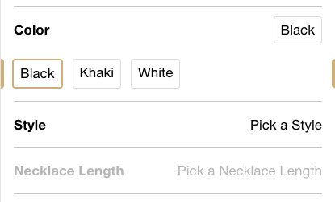
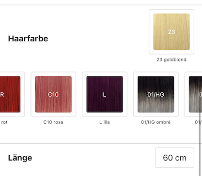

# Shopgate Connect - Extension pdp-variant-accordion

This extension will replace the default variant selection on PDP with an accordion style version.<br />
It also supports color and image swatches via additional product properties, provided by [@shopgate-project/products-properties](https://github.com/shopgate-professional-services/ext-products-properties)

<br />

## Preview with color swatches
 <br />

## Preview with image swatches


## Config
- `placeholderLines` (number) Number of placeholder lines shown while product variants are fetching. When set to 0 placeholder is deactivated. (default `3`)
- `horizontalInsets` (number) Horizontal insets for the characteristics in pixels (e.g. 16)
- `bottomInset` (number) Trailing inset for the characteristics block in pixels (e.g. 16)
- `animate` (boolean) Whether the characteristics accordions are supposed to be animated (_default_ `false`)
- `characteristicBorderColor` (string) Border color of a characteristic section (e.g. `#57606a`)
- `characteristicValueBorderColor`(string) Border color of a characteristic value (e.g. `#57606a`)
- `characteristicValueBorderColorSelected` (string) Border color of a selected characteristic value (e.g.`#0969da`)
- `showBottomBorder` (boolean) Whether the last characteristic has a border at the bottom (_default_ `true`)
- `useImageAsSwatch` (boolean) Whether the swatch should be shown as an image (_default_ `false`)
- `showSwatchAsCircle` (boolean) Whether the swatch is shown as a rectangle or a circle (_default_ `false`)
- `showLabelBelowSwatch` (boolean) Whether the label of the swatch is shown below the swatch itself (_default_ `false`)
- `imageOverlayLabelColor` (string) Text color of the optional image overlay label (_default_ `#fff`)
- `propertyWithColor` (string) An (additional) product property which contains a css color for a swatch. (_default_ ``)
- `colorCharacteristic` (Array) A list of characteristic names which are used as color swatch (e.g. ['Color', 'Shoe Color', 'Farbe'] (_default_ `null`)
- `imageSwatchSize` (number) The size of the image in pixel. (_default_ `50`)
- `imageSwatchBackgroundSize` (string) Defines how the image will be shown.V alue must be a property of CSS backgroundsize (_default_ `cover`)
- `sortColorImageCharacteristic` (string) Sort the Color Image Characteristic. String of the values (_default_ ``)
- `showVariantPrices` (boolean) Shows the prices in the variant selection (if product has only one characteristic!) (_default_ `false`)
- `variantSelectionAlwaysOpen` (boolean) Defines whether the variant selection is always open or not (if product has only one characteristic!) (_default_ `false`)
- `characteristicValueImageMapping` (Object) Each entry in the object represents a unique characteristic value (e.g. color) with its associated image and overlay label.
```json
  "characteristicValueImageMapping": {
      "black #01": { // characteristic value
          "imageOverlayLabel": "01",
          "imageUrl": "https://exmaple.com/cdn/shop/files/01_black.jpg"
      },
      "red #R": {
          "imageOverlayLabel": "R",
          "imageUrl": "https://exmaple.com/cdn/shop/files/R_red.jpg"
      },
      "..." : {}
  }
```

## Classes

The extension adds the following classes to its components to enable extended styling from other extensions:

- `pdp-variant-accordion` Applied to the wrapper of the characteristics block
- `pdp-variant-accordion__characteristic` Applied to each characteristic section
- `pdp-variant-accordion__characteristic.disabled` Applied to a _disabled_ characteristic section
- `pdp-variant-accordion__characteristic__header` Applied to the header of a characteristic section
- `pdp-variant-accordion__characteristic__values` Applied to the values wrapper of a characteristic section
- `pdp-variant-accordion__characteristic__value` Applied to each characteristic value
- `pdp-variant-accordion__characteristic__value.selected` Applied to the _selected_ characteristic value
- `pdp-variant-accordion__characteristic__value.disabled` Applied to a _disabled_ characteristic value
