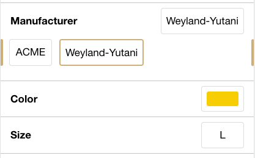

# Shopgate Connect - Extension pdp-variant-accordion

This extension will replace the default variant selection on PDP with an accordion style version.

## Config
- `horizontalInsets` (number) Horizontal insets for the characteristics in pixels (e.g. 16)
- `bottomInset` (number) Trailing inset for the characteristics block in pixels (e.g. 16)
- `animateAccordion` (boolean) Wether the characteristics accordions are supposed to be animated (_default_ `false`)
- `characteristicBorderColor` (string) Border color of a characteristic section (e.g. `#57606a`)
- `showBottomBorder` (boolean) Wether the last characteristic has a border at the bottom (_default_ `true`)
- `characteristicValueBorderColor`(string) Border color of a characteristic value (e.g. `#57606a`)
- `characteristicValueBorderColorSelected` (string) Border color of a selected characteristic value (e.g.`#0969da`)

## Classes

The extension adds the following classes to its components to enable extended styling from other extensions:

- `pdp-variant-accordion` Applied to the wrapper of the characteristics block
- `pdp-variant-accordion__characteristic` Applied to each characteristic section
- `pdp-variant-accordion__characteristic.disabled` Applied to a _disabled_ characteristic section
- `pdp-variant-accordion__characteristic__header` Applied to the header of a characteristic section
- `pdp-variant-accordion__characteristic__values` Applied to the values wrapper of a characteristic section
- `pdp-variant-accordion__characteristic__value` Applied to each characteristic value
- `pdp-variant-accordion__characteristic__value.selected` Applied to the _selected_ characteristic value
- `pdp-variant-accordion__characteristic__value.disabled` Applied to a _disabled_ characteristic value
